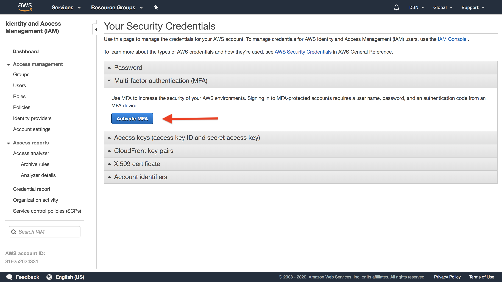
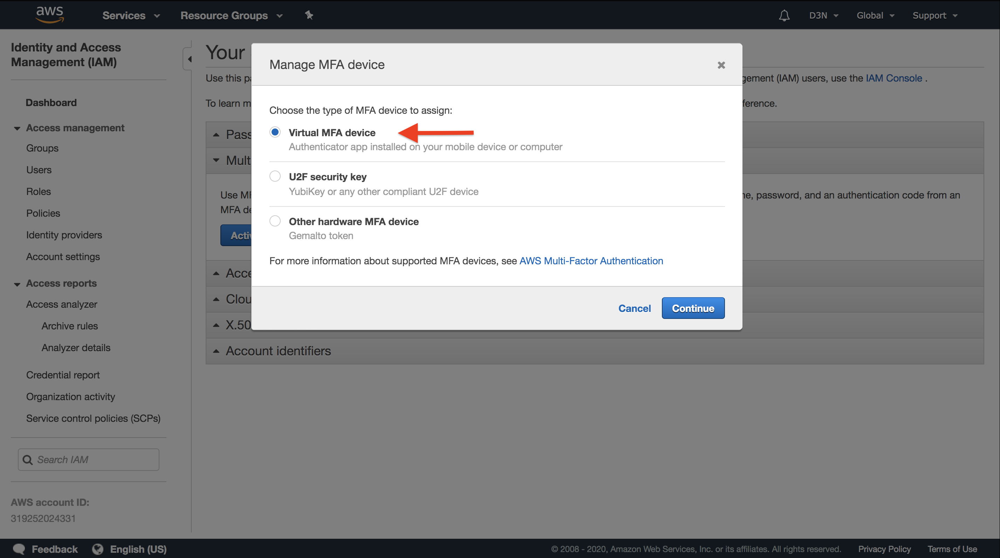

# Best practices

## Root user

With the root user you can perform any actions you need. However, the best way to manage your AWS sevices in terms of security is to use other I AM users to perform any actions. For example, you can create an Administrator user with necessary access rights and then use it for common operations you need.

## Groups

You do not need to assign custom policy for each I AM user, the best solution is to set `AWS managed policy` for group and then customize any user individually with inline policy.

## Billing Alert

There are may be some cases, when you do not know if the AWS service can charge you or not. Also you can forget to deactivate some service that was activated during studying AWS services. Anyway, it is recommended to set up `billing alarm` for your account for notifying when some money limit will be reached. You can choose any amount you want.

> Services -> CloudWatch -> Alarms(Billing) (*left menu*) -> Create alarm ->
> *Scroll down* -> *Define the limit* -> Next ->
> Create new topic -> *Enter topic name* -> *Enter email for notification* -> Create topic ->
> *Confirm subscription at your email box* -> *Set alarm name* -> Next -> Create alarm

## MFA

To secure your AWS account there is an opportunity to use multi-factor authentication. It can be activated this way:

> Services -> I AM -> MFA -> Activate MFA

> *Choose* Virtual MFA device

*NOTE: You need MFA app to be already installed to your device (phone, laptop, browser) to move to the next step.*

Then you will be prompted to scan QR-code or enter authentication codes. If codes option chosen you should enter two consecutive codes from your app.

Then you will see something like this:

## Authy vs Google Authenticator

As a personal preference, I recommend to use `Authy` app over `Google Authenticator` for `MFA`. It has some solid advantages compared to other apps, like multi-device support and encrypted recovery backups. You can install `authy` to your mobile and laptop, for example, and easily manage devices that you are using for MFA when needed (in case you lost your phone/laptop or decide to buy the new one).
